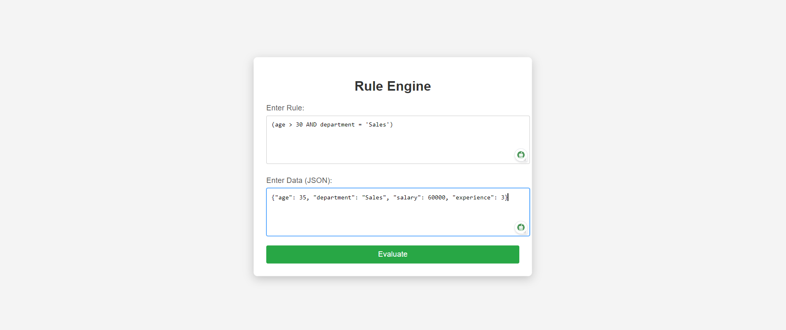
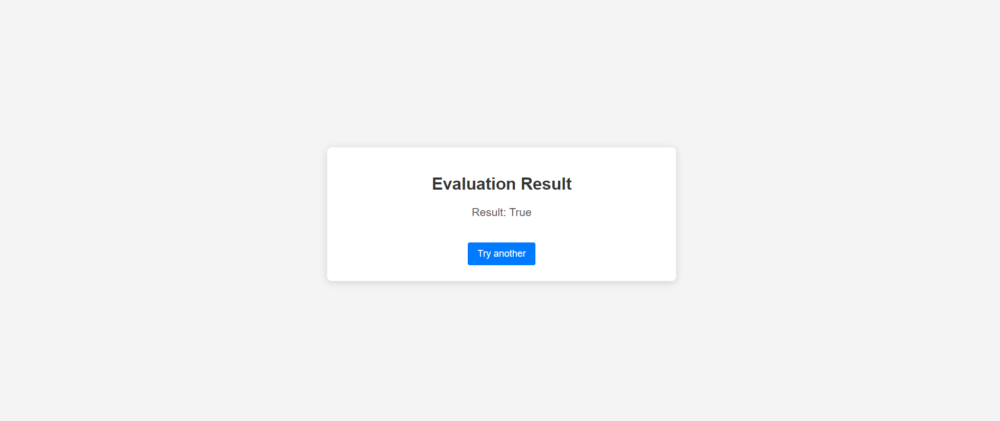

# RuleEngine

# Table of Contents

1. [Introduction](#introduction)
2. [Objective](#objective)
3. [Technologies Used](#technologies-used)
4. [Folder Structure](#folder-structure)
5. [Instructions](#instructions)
6. [Screenshots of the Project](#screenshots-of-the-project)
7. [Conclusion](#conclusion)
8. [Codebase](#codebase)


## Introduction

The Rule Engine Application is a 3-tier architecture system designed to determine user eligibility based on various attributes such as age, department, salary, and experience. It utilizes an Abstract Syntax Tree (AST) to represent conditional rules, allowing for dynamic creation, combination, and evaluation of these rules. The system is built with Django as the backend framework, providing a simple API for rule management and evaluation.

## Objective

The primary objective of this project is to develop a robust and flexible rule engine that allows users to define complex eligibility rules. This project demonstrates the use of AST for rule representation and supports various functionalities such as rule creation, evaluation, and combination. The system is designed to handle dynamic rules and provides a simple interface for interaction.

## Technologies Used

- **Backend Framework**: Django
- **Database**: MYSQL
- **Programming Language**: Python
- **Data Structure**: Abstract Syntax Tree (AST)
- **API Design**: RESTful APIs for rule management
- **Version Control**: Git & GitHub

## Folder Structure

```plaintext
RuleEngine/
│
├── manage.py                 # Django project management file
│
├── rule_engine/              # Main application directory
│   ├── __init__.py           # Initializes the package
│   ├── settings.py           # Project settings
│   ├── urls.py               # URL routing for the project
│   └── wsgi.py               # WSGI configuration for deployment
│
└── rules/                    # Rules application directory
    ├── migrations/           # Database migrations for the rules app
    │   └── __init__.py       # Initializes the migrations package
    │
    ├── templates/            # HTML templates for the rules app
    │   ├── index.html        # Main page template
    │   └── result.html       # Template for displaying results
    │
    ├── __init__.py           # Initializes the package
    ├── admin.py              # Admin interface configuration
    ├── apps.py               # Application configuration
    ├── models.py             # Database models for rule representation
    ├── tests.py              # Tests for the rules app
    ├── urls.py               # URL routing for the rules app
    └── views.py              # API views for handling requests
```


## Instructions

Follow these steps to set up and run the project locally:

**Clone the Repository**
   ```bash
   git clone https://github.com/md-ashraf98/RuleEngine.git
```

```bash
 cd RuleEngine
```

```bash
 pip install -r requirements.txt
```

```bash
 python manage.py migrate
```

```bash
 python manage.py runserver
```

```bash
 python manage.py test
```

## Screenshots of the Project

Below are some screenshots demonstrating the functionality of the Rule Engine Application:

1. **Creating a Rule**:
   

2. **Evaluating a Rule**:
   


## Conclusion

The Rule Engine application provides a robust framework for defining, combining, and evaluating rules based on various user attributes. By utilizing an Abstract Syntax Tree (AST) representation, the system allows for dynamic rule creation and modification. This project showcases the integration of a simple user interface, a powerful backend, and an efficient API, demonstrating how to handle complex conditional logic effectively. The application can be easily extended to support additional functionalities, making it a flexible solution for various eligibility criteria evaluations.

## Codebase

The source code for this project is hosted on GitHub. You can find it at the following link:

[RuleEngine GitHub Repository](https://github.com/md-ashraf98/RuleEngine)

Feel free to explore the code, contribute to its development, or utilize it as a reference for your projects.


